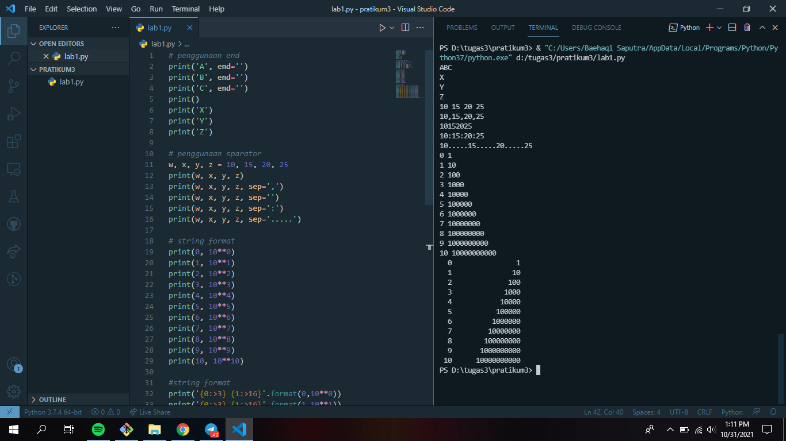
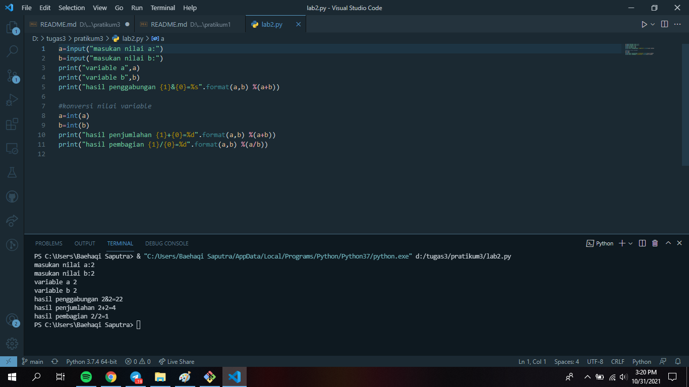
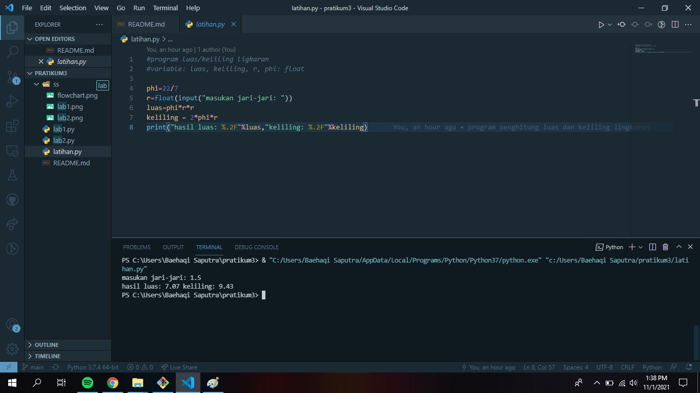
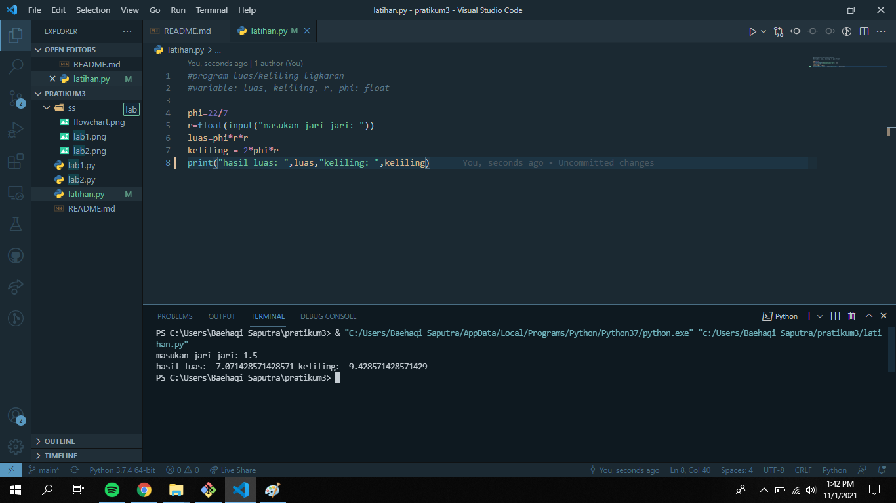
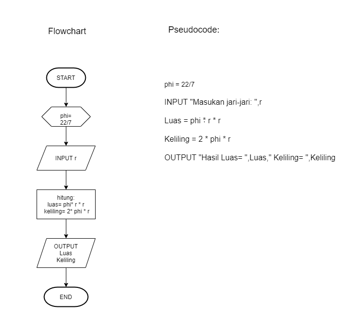

# pratikum3

## Latihan lab 1, lab 2 dan Tugas Latihan

### membuat Lab 1 dan Lab 2
tentang penggunaan end, penggunaan separator dan string format

### membuat program penghitung luas dan keliling lingkaran
ini adalah hasil program yang telah dibuat utuk menhitung luas dan keliling lingkaran serta hasil Runing/eksekusi

### membuat flowchart 
ini adalah flowchart dari program penghitung luas dan keliling lingkaran:

FLOWCHART

untuk gambar 1, terdapat dua angka setelah koma

untuk gambar ke 2, terdapat lebih dari dua angka setelah koma

TERIMAKASIH
